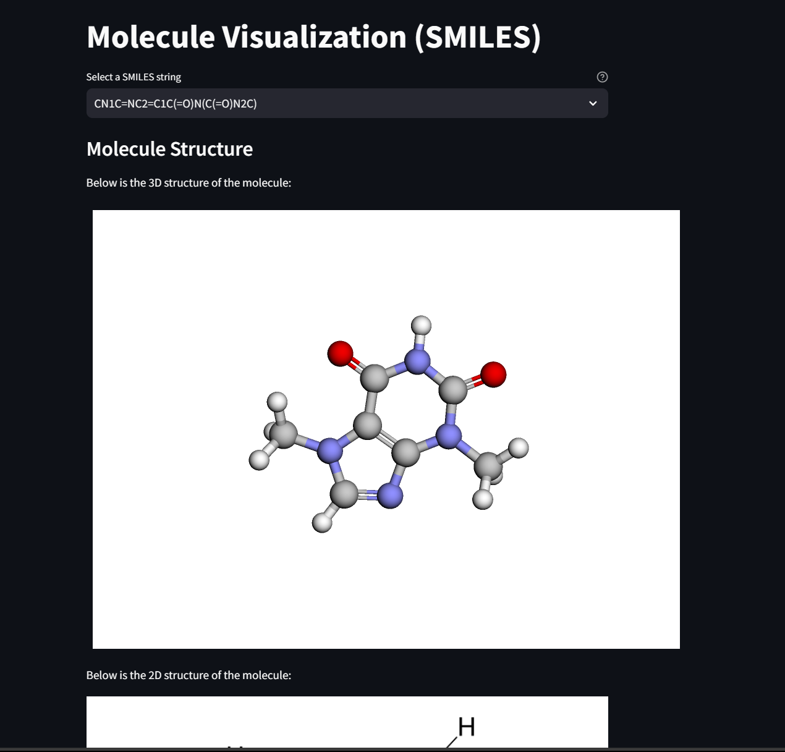

## Get Started

Check if you have the App Required Environment:

* [Python 3.6+](https://www.python.org/downloads/)
* ~~[Node.js](https://nodejs.org)~~
* ~~[npm](https://docs.npmjs.com/downloading-and-installing-node-js-and-npm)~~

Libraries

* [Streamlit](https://pypi.org/project/streamlit/)
* [stmol](https://pypi.org/project/stmol/)
* [rdkit](https://pypi.org/project/rdkit/)
* [py3Dmol](https://pypi.org/project/py3Dmol/)
  
```
pip install streamlit stmol rdkit py3Dmol
```

## How to run the App:

```
cd app
cd molecule_visualization
streamlit run app.py 
```

This app should look like this




## Helpful links

* [Streamlit](https://streamlit.io) Components.
* [Streamlit Components documentation](https://docs.streamlit.io/library/components)
* [Streamlit Forums](https://discuss.streamlit.io/tag/custom-components)
* [Streamlit Components gallery](https://www.streamlit.io/components)
Details in https://github.com/streamlit/component-template
